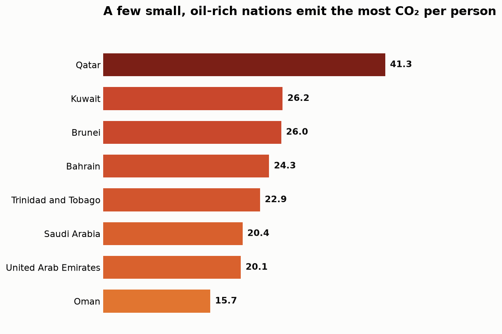
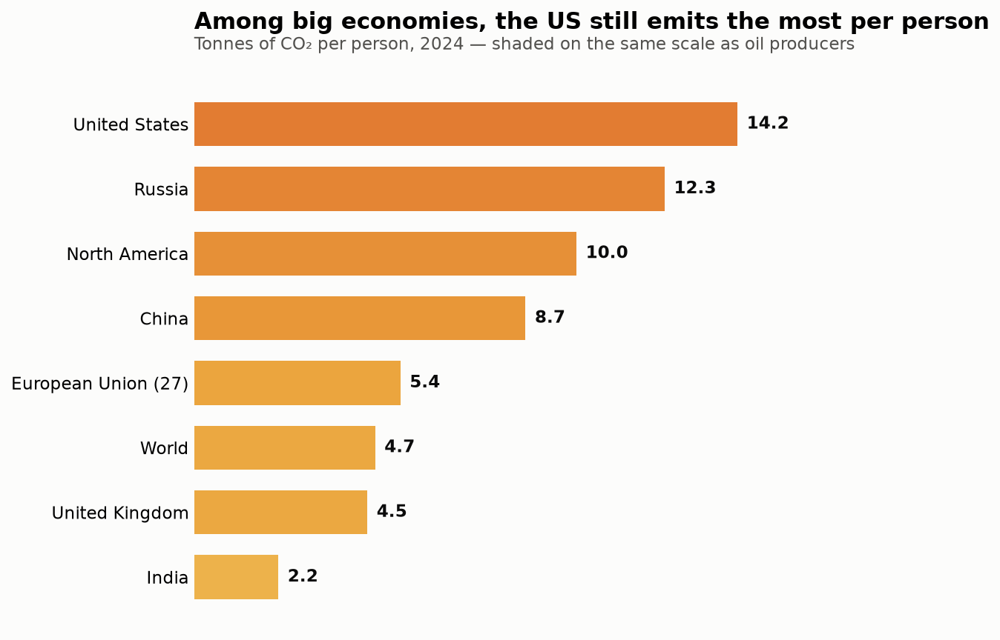
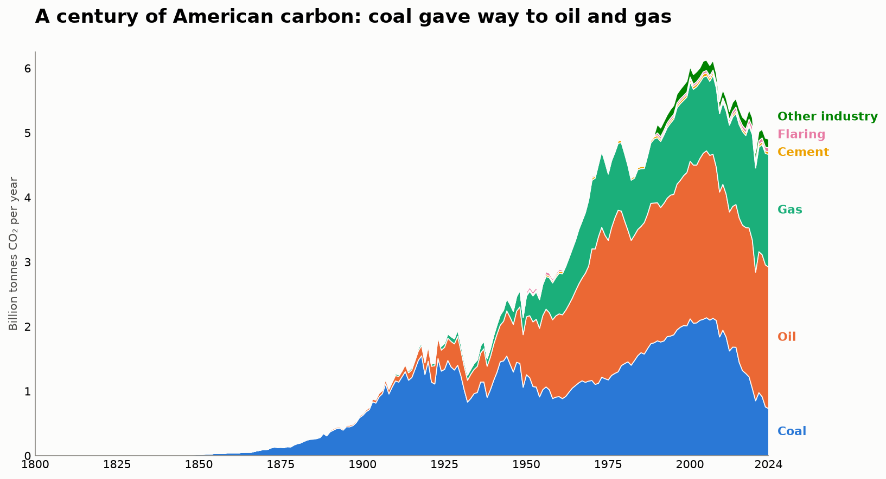

# visualisation-lib

A small, importable plotting library, organised with the
[Cookiecutter Data Science](https://cookiecutter-data-science.drivendata.org/) layout.

- **Install name** (pip / PyPI): `viz-lib`
- **Import name** (in Python): `viz_lib`

(As with any package, the install name uses a hyphen and the import name uses
an underscore — `pip install viz-lib`, then `import viz_lib`.)

## Install

```bash
# from a local checkout (editable, for development)
pip install -e .

# once published
pip install viz-lib
```

## Use

```python
import pandas as pd
import viz_lib as viz

df = pd.read_csv("data.csv")
viz.ranked_bar(df, category="country", value="co2_per_capita")
```

Public API — six plotting functions plus helpers:

| Function | Job | Example chart |
| --- | --- | --- |
| `ranked_bar` | rank a value across items | CO₂ per person by country |
| `stacked_area` | composition over time | US CO₂ by fuel, 1800–2024 |
| `load_dataset` / `datasets` | load a bundled sample CSV | — |
| `apply_theme`, `series_color`, `smog_color`, `PALETTE`, `SMOG` | the shared look | — |

## Gallery

The three charts, rendered by the example scripts in `notebooks/`:

**Oil producers — CO₂ per person**



**Major economies — CO₂ per person** (same color scale as above)



**A century of American carbon** — US CO₂ by fuel, 1800–2024



### Bundled datasets

Sample CSVs ship **inside** the package (`viz_lib/data/`) and are read with
`importlib.resources`, so they load whether you run from a checkout or an
installed wheel:

```python
import viz_lib
viz_lib.datasets.available()          # ['co2_per_capita', 'us_co2_by_fuel', ...]
df = viz_lib.load_dataset("us_co2_by_fuel")
```

## Plots

Plot functions live in `src/viz_lib/`. They share one contract: tidy data plus
role keywords, an optional `ax` for composition, and a returned matplotlib
object. A single theme (`viz_lib.theme`) gives every plot one identity using a
validated, colorblind-safe palette.

### `ranked_bar`

A sorted horizontal bar chart for comparing a value across items (the
Evergreen Chart Chooser's pick for ranking with long labels). Built to the
Data Viz Checklist: sorted by value, direct labels, no gridlines/border, a
takeaway title, and a CO₂-themed "smog" color ramp (darker = more emissions)
that stays legible in black & white and for colorblind readers.

```python
import pandas as pd
from viz_lib import ranked_bar

df = pd.read_csv("data/raw/co2_per_capita.csv")
df = df[df["Year"] == 2024]

fig = ranked_bar(
    df, category="Entity", value="CO₂ emissions per capita",
    reference=4.7, reference_label="World average",
    title="A few small, oil-rich nations emit the most CO₂ per person",
    subtitle="Tonnes of CO₂ per person, 2024",
)
```

`compare="<earlier-column>"` adds a ▲/▼ change tag per bar; pass the same
`vmax` to two charts to share one honest color scale. See
`notebooks/co2_bars.py` for the two-group CO₂ example.

### `stacked_area`

Composition over time, with direct band labels and optional dated event
markers for an editorial "hero" chart. See `notebooks/us_co2_hero.py`.

```python
from viz_lib import stacked_area, load_dataset

df = load_dataset("us_co2_by_fuel")
fig = stacked_area(
    df, x="Year", series=["Coal", "Oil", "Gas", "Cement", "Flaring", "Other industry"],
    title="Coal gave way to oil and gas",
    events=[{"year": 2007, "label": "2007\nemissions peak", "y": 0.98}],
)
```

## Example notebooks & Colab demo

Runnable examples live in `notebooks/` and `reports/`:

| File | What it produces |
| --- | --- |
| `notebooks/co2_bars.py` | two ranked bar charts (oil producers, major economies) |
| `notebooks/us_co2_hero.py` | US CO₂ by fuel over time (stacked area) |

**Colab presentation notebook** (run one cell at a time):

- `notebooks/us_carbon_story_github.ipynb` — installs `viz_lib` from GitHub,
  then draws the two charts (datasets ship inside the package, nothing to upload).

## Project structure

```
├── data/               # raw, interim, processed, external
├── notebooks/          # exploration only
├── src/                # imported modules
├── models/             # trained artifacts
├── reports/figures/    # graphics for write-ups
├── docs/               # mkdocs site
└── pyproject.toml      # project metadata
```

| Path               | Purpose                                             |
| ------------------ | --------------------------------------------------- |
| `data/`            | Raw, interim, processed, and external data.         |
| `notebooks/`       | Jupyter notebooks for exploration only.             |
| `src/`             | Reusable, importable Python modules.                |
| `models/`          | Trained and serialized model artifacts.             |
| `reports/figures/` | Graphics generated for write-ups and reporting.     |
| `docs/`            | MkDocs documentation site.                          |
| `pyproject.toml`   | Project metadata and build configuration.           |

## Building & installing

```bash
pip install -e .                 # editable install for development
python -m build                  # build a wheel into dist/ (bundles the datasets)
pip install dist/viz_lib-*.whl   # install the built wheel
```

## Data source

The bundled sample datasets are CO₂ and greenhouse-gas figures from the
**Global Carbon Budget (2025)** via
[Our World in Data](https://ourworldindata.org/co2-and-greenhouse-gas-emissions),
licensed **CC BY**.

## License

Released under the [MIT License](LICENSE).
